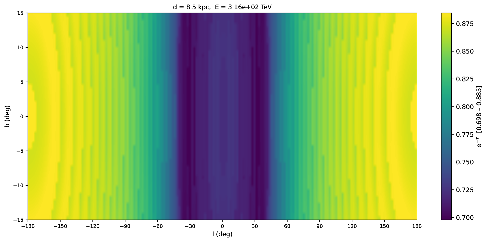

# Absorption Map — 银河系 γ 射线吸收谱数据立方体

## 简介

本项目计算了银河系不同视线方向 (l, b) 和距离 d 上的 γ 光子吸收效应，输出为 **e⁻ᵗ (survival probability)** 随能量 E 的变化曲线。

含 **563,091 个视线方向** 的吸收谱，打包为单个 FITS 文件。

## 数据产品

### `absorption_map.fits`

4 维数据立方体，主图像存储 survival probability e⁻ᵗ：

| 轴 | 维度 | 范围 | 步长 | 点数 |
|----|------|------|------|------|
| NAXIS4 (l) | 银经 | 0° – 360° | 2° | 181 |
| NAXIS3 (b) | 银纬 | -15° – +15° | 0.5° | 61 |
| NAXIS2 (d) | 距离 | 0 – 25 kpc | 0.5 kpc | 51 |
| NAXIS1 (E) | 能量 | 0.1 – 10⁷ TeV | 对数等间隔 | 81 |

还包含扩展表 `ENERGY_GRID`（INDEX, E_TeV 两列），方便查能量值。

> **注意**：此文件 175 MB，通过 Git LFS 或拆分文件（`abs_map.part_aa`、`abs_map.part_ab`）提供。  
> 合并方式：`cat abs_map.part_* > absorption_map.fits`

### `data/MilkyWay_DR0.5_DZ0.1_DPHI10_RMAX20_ZMAX5_galprop_format.fits.gz`

银河系气体分布模型（gzip 压缩 FITS），用于吸收计算。

---

## 脚本说明

### 批量计算

| 脚本 | 说明 |
|------|------|
| `run_all_absorption.sh` | 批量遍历 (l,b,d) 参数空间，每个方向生成一个 txt |
| `run_absorb.sh` | 单次计算脚本 |

用法：
```bash
./run_all_absorption.sh -p 40 -r   # 40进程并行，断点续传
kill $(cat all_output/.pid)         # 安全停止
```

### 合并为 FITS

```bash
python3 merge_to_fits.py
```
将 `all_output/l*.txt`（56万个中间文件）合并为 `absorption_map.fits`。

### 画单方向吸收谱

```bash
python3 plot_absorption.py <l> <b> <d>
```
示例：
```bash
python3 plot_absorption.py 98 -9.0 6.0
# 输出: l98.0_b-9.0_d6.0_plot.pdf + _plot.txt
```

### 画银道天图

```bash
python3 plot_skymap.py -d <距离> -e <能量>
```
示例：
```bash
python3 plot_skymap.py -d 8.5 -e 3000          # 单张天图
python3 plot_skymap.py -d 0.5 -e 1,10,100,1e4  # 多面板
python3 plot_skymap.py -d 0.5                   # 全部81个能量（9×9面板）
```

## 效果展示

### d = 8.5 kpc, E = 300 TeV 银道天图




- 计算程序：`all8_cmb_galpropall_interpolationN_argvZ`（C 源码见 `.c` 文件）
- 吸收模型基于银河系星际辐射场（CMB + 尘埃辐射 + 星光）与气体分布
- 输出值：**e⁻ᵗ**（光子存活概率）。1.0 = 无吸收，接近 0 = 几乎完全吸收

## 依赖

### 系统库

计算程序 `all8_cmb_galpropall_interpolationN_argvZ` 依赖 **CFITSIO** 库（读取 FITS 文件）：

```bash
# CentOS / RHEL
yum install cfitsio

# Ubuntu / Debian
apt install libcfitsio-dev

# Conda
conda install -c conda-forge cfitsio
```

安装后可检查：
```bash
ldd all8_cmb_galpropall_interpolationN_argvZ | grep cfitsio
# 应输出类似: libcfitsio.so.X => /path/to/libcfitsio.so.X
```

### Python

```
numpy  astropy  matplotlib
```

## 目录结构

```
.
├── absorption_map.fits        # 最终数据产品（需 merge 恢复）
├── abs_map.part_aa / part_ab  # 拆分后的 FITS
├── merge_parts.sh             # 合并 FITS
├── data/                      # 输入模型文件
├── all_output/                # 56万个中间 txt（未上传）
├── merge_to_fits.py           # txt → FITS
├── plot_absorption.py         # 单方向画图
├── plot_skymap.py             # 银道天图画图
├── run_all_absorption.sh      # 批量计算脚本
├── run_absorb.sh              # 单次计算脚本
├── all8_cmb_galpropall_interpolationN_argvZ    # 编译好的计算程序
├── all8_cmb_galpropall_interpolationN_argvZ.c  # C 源码
└── 1LHAASO_PeVCat_DistOrder_lb.txt             # LHAASO PeV 源目录
```
